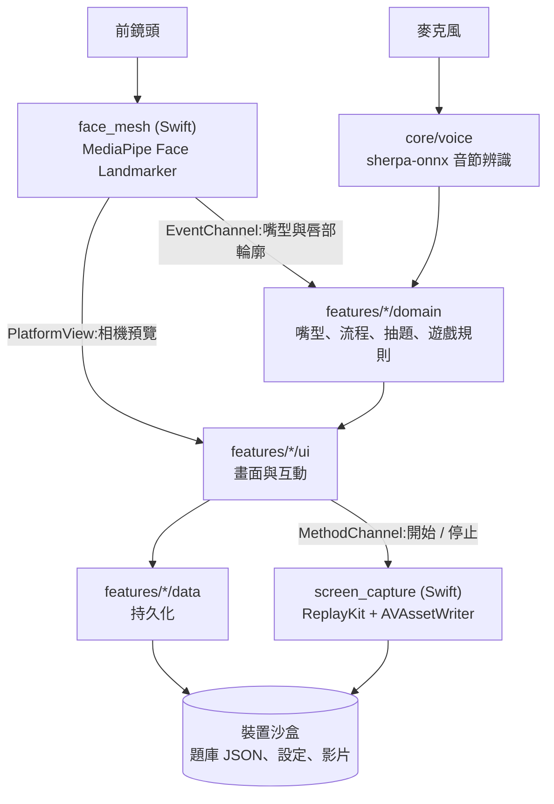

# 「健口動一動」App — 讓長輩持之以恆的口腔訓練工具。

## 問題與目標

- **解決的問題**：降低失智風險與病症程度
- **目標使用者**：65 歲以上年長者
- **預期影響**：
  1. 提升咀嚼力 → 降低失智風險與病症程度(活化海馬迴)、提升長輩飲食能力
  2. 提升反應力 → 延緩認知退化速度

## 核心功能

- **健口操** — 引導完成臉部動作、舌壓訓練、發音練習，透過臉部網格偵測判別動作正確、語音辨識判別發音正確。
- **快問快答** — 家人出題(圖片或文字,可加錄音唸題),長輩限時作答。內建 5 題預設題目(含圖片與唸題錄音)僅作為示例。抽題依出題次數分層,任兩題的出題次數不會差超過 1，不會有題目長期抽不到。其中「今天星期幾」的選項與正解在出題當下才產生，答案不會過期。
- **小遊戲** — 唸「怕 / 踏 / 卡 / 拉」進行語音操作角色、俄羅斯方塊移動。
- **影片記錄** — 健口操與快問快答全程錄影(畫面 + 收音)存於手機裝置端，家人可以重複觀看與分享。

## 系統架構



- **`core/`** — 共用基礎:錄影、語音辨識、主題與共用元件。不認識任何 feature。
- **`features/<功能>/`** — 每個功能各自切 `domain` / `data` / `ui` 三層。`domain` 是純 Dart 的判定規則(嘴型對不對、怎麼抽題、遊戲盤面),不碰畫面也不碰檔案,能不開模擬器就測;`data` 只管持久化;`ui` 只管畫面。
- **`packages/`** — 兩個專案內的 plugin,把 iOS 原生能力包成 Dart API:`face_mesh`(相機 + 臉部網格)、`screen_capture`(螢幕錄影)。
- [`test/architecture_test.dart`](test/architecture_test.dart) 會逐檔檢查 import。

## 使用技術

| 類型 | 技術／服務 | 用途 |
| --- | --- | --- |
| AI 模型 | **Google MediaPipe Face Landmarker** | 開源地端臉部網格偵測，判別健口操嘴型正確 |
| AI 模型 | **sherpa-onnx streaming zipformer transducer** | 開源地端即時串流語音辨識，判別健口操發音正確 |
| 前端 | **Flutter / Dart** | 手機平板應用介面。目前發布於 iOS(iPhone / iPad),Android 待補原生實作,見「限制與未來工作」 |
| 原生 | **Swift** | `face_mesh`:相機 + MediaPipeTasksVision 橋接;`screen_capture`:ReplayKit 錄影與 AVAssetWriter 音影合成 |
| 原生橋接 | **MethodChannel / EventChannel / PlatformView** | 三種各有職責:**MethodChannel** 送一次性指令(開始、停止);**EventChannel** 讓原生端持續推偵測結果,不必由 Dart 端輪詢;**PlatformView** 把原生相機預覽直接嵌進 Flutter 畫面,不必每張影格搬回 Dart |

## 安裝與執行

環境需求:Flutter 3.35(stable)、Xcode 與 CocoaPods、**iOS 13.0 以上的 iPhone / iPad 實機**。

```bash
flutter pub get
cd ios && pod install && cd ..
flutter run --release    # 接上實機
```

- **一定要用實機**:相機、麥克風、ReplayKit 螢幕錄影在模擬器上都不會動。示範請用 `--release`,debug 模式下語音辨識會有明顯延遲。
- 首次啟動會依序詢問相機、麥克風、相簿權限,以及 ReplayKit 的錄影確認 —— 都允許才錄得到影片。
- 語音辨識模型(約 70 MB)已打包在 `assets/asr/`,不必另外下載,但第一次 build 會比較久。
- `flutter test` 可跑完整單元測試,不需要實機。

## 作品展示

- 作品展示網址(選填)：_(待補)_
- 評選影片：_(待補)_

## 限制與未來工作

- **語音辨識用的是德文模型**。パタカラ 要認 pa / ta / ka / ra 四個單音節,而國語沒有 ラ 的 [ɾa],中文模型只吐 `<unk>`;俄、法、英、多語模型實測在單音節上也都不如德文,最後選了德文 streaming zipformer,再用熱詞(modified beam search)補強。ta 偶爾仍會被聽成 ka。完整取捨與實測記錄在 [`assets/asr/README.md`](assets/asr/README.md)。
- **完全離線,資料只在這一台裝置上**。兩顆 AI 模型都跑在地端,程式裡沒有任何網路呼叫 —— 沒網路也能用,長輩的臉、聲音與影片不會離開手機。代價是模型得跟著 app 打包,而且沒有帳號與雲端備份,換手機資料不會跟著走。
- **目前只支援 iOS**。Flutter 介面本身跨平台,但臉部偵測與螢幕錄影是 iOS 原生實作(`packages/` 兩個 plugin 底下只有 `ios/`);Android 版需要另外接 MediaPipe Android 與 MediaProjection。
- **未來:接後端支援學術研究**。若相關單位要驗證成效,可加上去識別化的數據匯出(訓練次數、正確率、完成率)與後端彙整。

## 第三方服務、資料與素材

| 項目 | 來源 | 授權 |
| --- | --- | --- |
| MediaPipe Tasks Vision(iOS Pod) | [google-ai-edge/mediapipe](https://github.com/google-ai-edge/mediapipe) | Apache-2.0 |
| `face_landmarker.task` 模型 | [MediaPipe Face Landmarker model card](https://ai.google.dev/edge/mediapipe/solutions/vision/face_landmarker) | Apache-2.0 |
| sherpa-onnx(Dart/iOS 執行期) | [k2-fsa/sherpa-onnx](https://github.com/k2-fsa/sherpa-onnx) | Apache-2.0 |
| `sherpa-onnx-streaming-zipformer-de-kroko-2025-08-06` | [sherpa-onnx asr-models releases](https://github.com/k2-fsa/sherpa-onnx/releases/tag/asr-models) | Apache-2.0 |
| `record` 6.2.1 | pub.dev | BSD-3-Clause |
| `audioplayers` 6.7.1 | pub.dev | MIT |
| `image_picker` 1.2.2 | pub.dev | Apache-2.0 |
| `path_provider` 2.1.5 / `share_plus` 12.0.2 / `video_player` 2.10.1 | pub.dev | BSD-3-Clause |
| `sherpa_onnx` 1.13.7 | pub.dev | Apache-2.0 |
| Flutter SDK 與 `cupertino_icons` / `flutter_lints` / `path` | pub.dev | BSD-3-Clause |
| 預設題目的圖片(`assets/quiz/*.jpg`) | AI 生成,專案自有 | 可自由使用 |
| 預設題目的唸題錄音(`assets/quiz/*.m4a`) | 團隊自錄 | 可自由使用 |

## 團隊成員

| 姓名 | 分工 |
| --- | --- |
| Aaron 蔡佳峪 | 主要開發者(產品設計、Flutter、模型選型與調校) |

## License

本專案採用 **MIT License**,詳見根目錄的 [`LICENSE`](LICENSE)。
